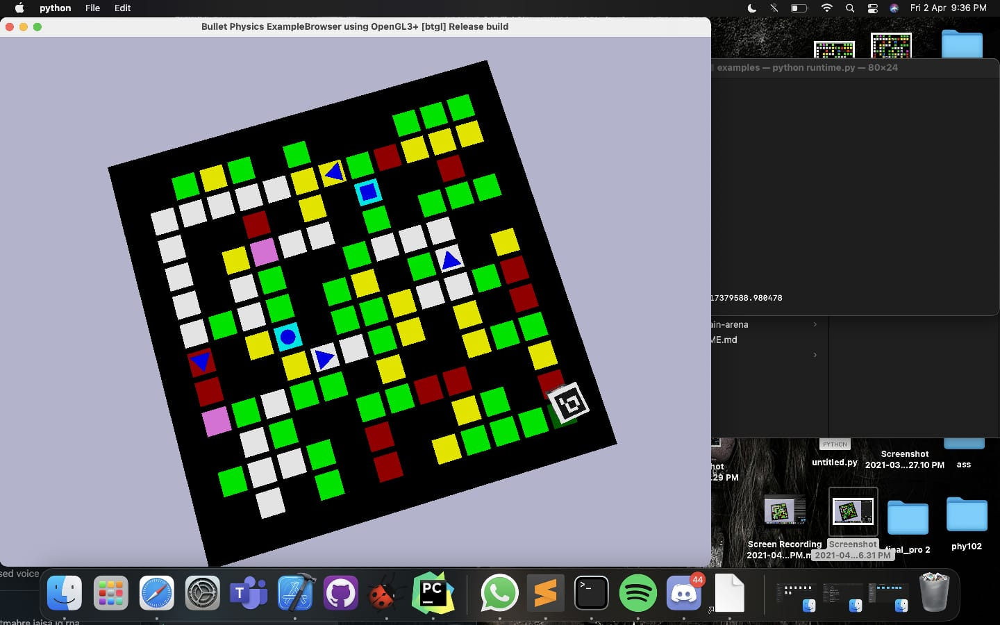

# Pixelate2021-PathplanningBot

**This code is our team's submission for Pixelate Event-2021 in which we stood at 2nd Position among 30+ teams.
Pixelate is computer vision based robotic event in which we are asked to design autonomous self moving robot to solve a particular problem.
This year's problem statement was inspired from real world problem of traffic in cities.We need to make the robot which will collect the patient from one place and drop him/her to the nearest hospital by taking shortest path available following one way road constraints.**

**The whole arena is designed by Robotics Club IIT(BHU) Varanasi**
*github-link for arena*-https://github.com/Robotics-Club-IIT-BHU/Pixelate_Sample_Arena

# ARENA-IMAGE

#Bot Running

